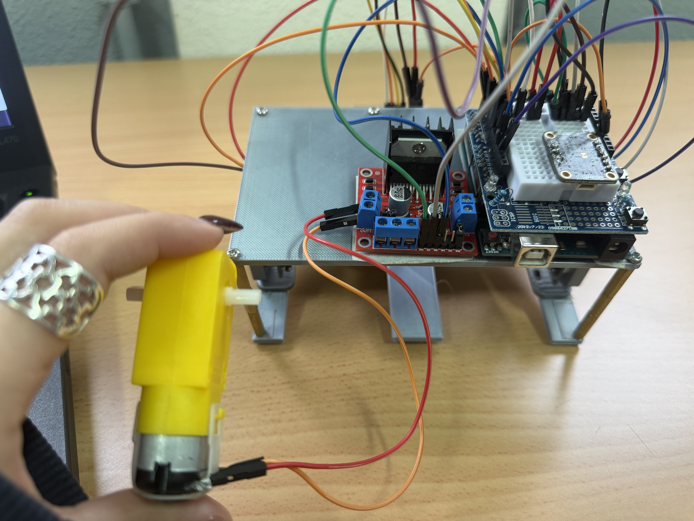
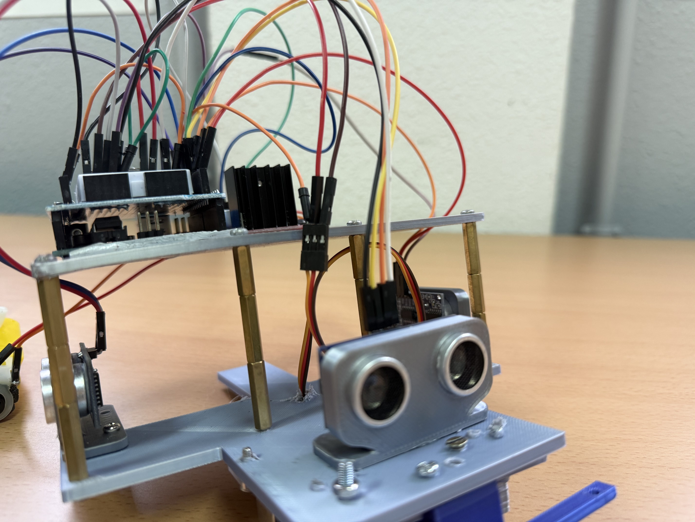
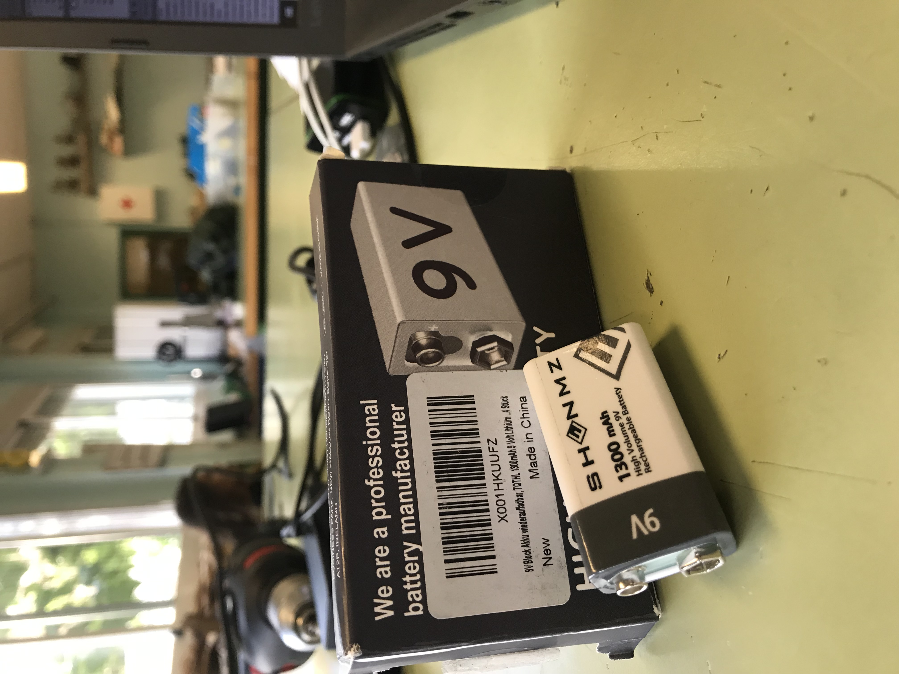
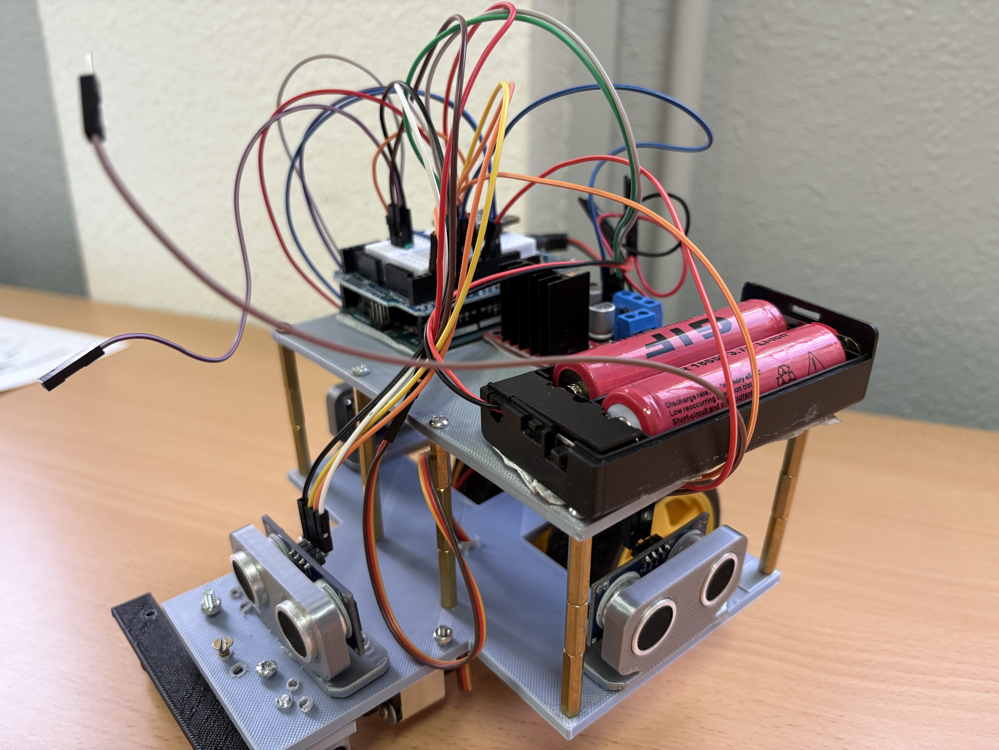

# Alimentación del robot

## Conexionado 
Para el conexionado de todos los componentes hemos necesitado tanto la placa de control Arduino, como una protoboard y un escudo. La placa junto a la protoboard han servido para la conexión de todos los compenentes menos los motores, los cuales hemos conectado al escudo.

### Conexionado del Escudo L298N
Lo primero fue conectar el motor al escudo. La alimentación, la consigue mediante los OUT1 y OUT2. Y para el control y la posterior programación de este; necesitamos establecer el pin IN1, IN2, y ENA. Los cuales controlan la dirección a la que gira el motor (para alante o para atrás) y la velocidad. En nuestro caso, así hemos establecido estos pines:
1. ENA: pin 5
2. IN1: pin 6
3. IN2: pin 7

   
### Conexionado de los sensores de ultrasonidos
Para el correcto funcionamento de nuestro robot, necesitábamos al menos 3 sensores de ultrasonidos que midieran las distancias entre las paredes. Estos sensores tienen 4 pines a los que conectarse. Uno de 5V y otro de GND los cuales le proporcionan la energía que necesita para funcionar. Y después, tiene otros dos pines más de control, el TRIGGER y el ECHO; que uno emite la señal y el otro la recibe. Así es cómo lo hemos conectado:
- Ultrasonidos de la izquierda
1. VCC: 5V
2. TRIGGER: pin 2
3. ECHO: pin 1
4. GND: GND
- Ultrasonidos del centro
1. VCC: 5V
2. TRIGGER: pin 3
3. ECHO: pin 4
4. GND: GND
- Ultrasonidos de la derecha
1. VCC: 5V
2. TRIGGER: pin 11
3. ECHO: pin 12
4. GND: GND
   

### Conexionado del servomotor
Para los giros era necesario incorporar un mecanismo de dirección delantero. Para eso utilizamos un servomotor, el cual conectamos a 5V, a GND y al pin 9.

## Baterías
Uno de los mayores desafíos que enfrentamos durante el montaje del robot fue la implementación de su sistema de alimentación. Desde el inicio del proyecto, quedó claro que alimentar de manera eficiente todos los componentes: motores, sensores, placa y posibles componentes adicionales, no sería tarea sencilla. Algunas razones por las que tuvimos que escoger estas pilas son:

Las pilas de 9 V no ofrecían suficiente corriente para alimentar los motores sin caídas de tensión.
Las pilas más pequeñas AAA, incluso apiladas en serie, no proporcionaban la capacidad energética necesaria para mantener el robot funcionando por largos periodos.
Otra opción también era utilizar de 9 V recargables de 1300mAh. Sin embargo de experiencias anteriores ya éramos conocedores de que no serviría ya que no tiene la capacidad para alimentar a todos los componentes necesarios. 
 

 Por esto, decidimos optar por el uso de dos baterías recargables tipo 18650 de 9900 mAh cada una, conectadas en serie mediante un portapilas específico para este formato. Además de proporcionar un voltaje suficiente, también dotaba al robot de una alta capacidad de carga (autonomía prolongada).
  

