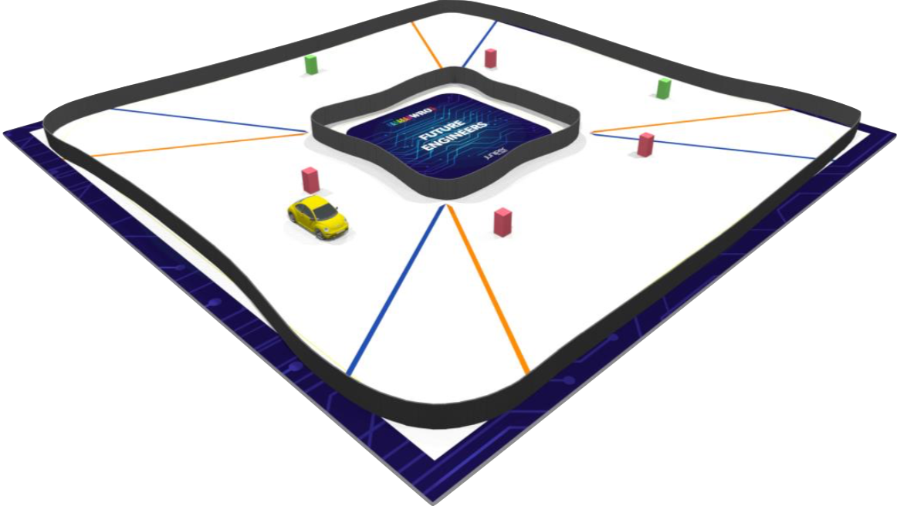

# Objetivo del reto
El objetivo de este reto es que nuestro coche autónomo sea capaz de conducir de manera totalmente autónoma adaptándose a un circuito cuya dirección cambia de forma aleatoria en cada ronda, lo que implica que el vehículo debe ajustarse rápidamente a nuevas condiciones, todo sin intervención humana, asegurando así una conducción eficiente y segura en cualquier escenario que se le presente.

