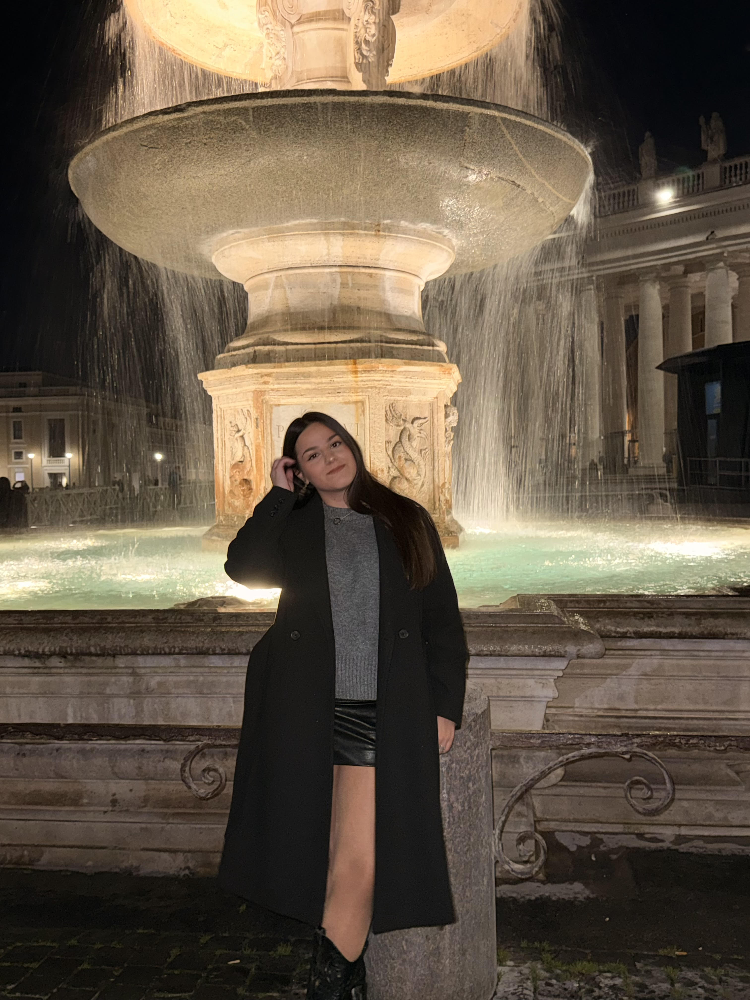
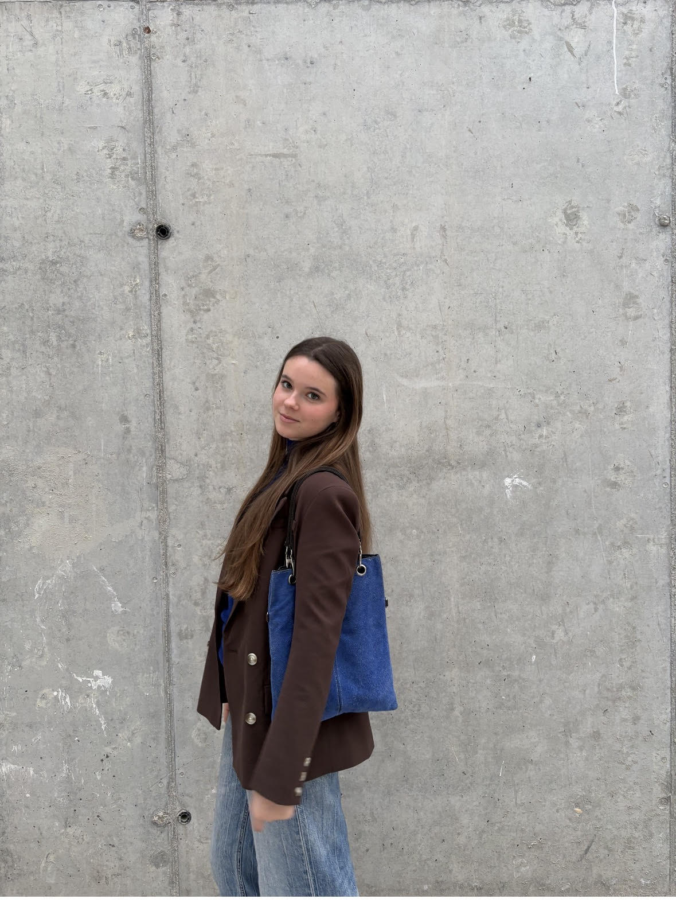

# Presentacción del equipo
¡Hola! Somos Azzaiteras WALL-E, un equipo compuesto por Noa Torres Serra, Eva Espinosa Ortiz y Lidia Requena Torres. Somos dos actuales alumnas y una exalumna del IES Az-Zait, un pequeño instituto de Jaén con un gran equipo de robótica.
(foto del equipo)

## Sobre Eva
¡Hola! Soy Eva. Tengo 15 años y soy una estudiante del instituto Az-Zait. Estoy en 4º de ESO y desde que entré he estado en el equipo de robótica. He participado dos veces en dos años diferentes en la WRO de Jaén, he estado en la WRO Nacional en 2023 en la Seu d´Urgel. También he participado en la WRO de Madrid. Y en la última competición en la que participé fue en el Open de Brescia, en septiembre de 2024. Soy una chica trabajadora, graciosa y a veces demasiado perfeccionista. Por eso mismo, me gusta desconectar y disfrutar con mis amigos los fin de semana. 

## Sobre Lidia
Mi nombre es Lidia Requena Torres, tengo 16 años y actualmente estoy estudiando en otro instituto un grado formativo sobre Atención a Personas en Situación de Dependencia. Llevo los cuatro años de la ESO participando en robótica, ya que me parece muy interesante, entretenido y lo más importante, ¡divertido! Me dieron la oportunidad de seguir participando por las tardes y no me lo pensé. Aprendo mucho con nuestro maravilloso profesor y me lo paso genial con mi equipo. Mis hobbies son jugar al fútbol, estar con mis amigos y familia. Me gustan mucho estar con los niños pequeños.
(foto Lidia)

## Sobre Noa
Hola, mi nombre es Noa Torres Serra, tengo 15 años y soy alumna del instituto IES Az-zait de Jaén. Actualmente estoy estudiando 4º de la ESO y llevo los cuatro años partcipando en el taller de robótica. He participado en dos competiciones nacionales: Almería 2024 y Cáceres 2025. También tuve la oportunidad de asistir a la nacional en la Seu d´Urgel. Estas experiancias me han enseñado mucho y he pasado muy buenos momentos en ellas, por eso mismo,¡voy a repetir este año!. Me considero una persona súper activa, me encanta participar en cualquier actividad que me permita aprender, viajar o conocer gente.

