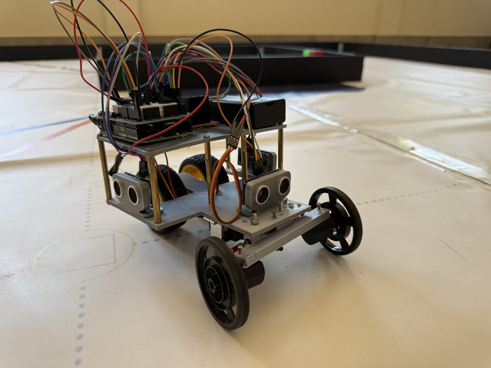

<h1 align="center">Future Engineers 2026 </h1>

<table>
  <tr>
    <td>
      
      <p style="text-align: center; font-size: 24px; font-weight: bold;">WALL-E</p>
    </td>
  </tr>
</table>


 ### 📌 Table of Contents

> [!TIP]
> Click the arrow below 👇 to expand the **Table of Contents**.  
> Every item is a clickable link to a folder or README file in this repository.

<details>
<summary><b>📂 Table of Contents</b></summary>

1. [Summary README](/README.md)

2. [Introduction](/Introduccion/)  
   - [Objective](/Introduccion/Objetivo.md)
   - [Team presentation](/Introduccion/Presentacion_equipo.md)
  
3. [Initial Conditions](/Condiciones_Previas/Condiciones_Previas.md)
   -  [Materials and hardware - software relation](/Condiciones_Previas/Materiales_acabado.md)
     
4. [Mechanics](/Mecánica/)
   - [Chassis](/Mecánica/Chasis.md)
   - [Steering system](/Mecánica/Direccion.md)
     
5. [Electronics](/Electrónica/)
   - [Power system](/Electrónica/Alimentación.md)
   - [Design](/Electrónica/Diseño.md)
   - [Components](/Electrónica/Componentes.md)
     - Servomotor
     - Board
     - Shield
     - Ultrasonic sensors
     - Gyroscope
     - Motor
     - Bateries
 6. [Programme](/Programación/)
    - [Programme development](/Programación/Explicación_programa.md)
    - [Flow charts](/Programación/Pensamiento_lógico.md)
  7. [3D Files](/Archivos_en3D/)
  9. [Analysis](/Análisis/)
     - [Detected problems](/Análisis/Problemas_detectados.md)
     - [Improvement proposals](/Análisis/Diagramas_flujo.md))
   10. [Final results](/Resultado/)
11. [Conclusion](/Conclusiones/)
    - Acquired knowleadge
12. [Bibliography](/Bibliografía/)
    - Arduino
    - Tinkercad
    - PixyCam
    - LucidChart
</details>

## Introduction 
> [!WARNING]
> Click the link below 👇 to see more information about the introduction.
> 
> [For more information click here](Introduccion/)

> [!IMPORTANT]
> Click the link below 👇 to see the final result of our robot.

[](https://www.youtube.com/watch?v=cXj32blsBB0)

### Presentation 
Our team´s robot is called WALLE. WALLE was designed for the Future Engineers challenge of the World Robot Olympiad. In this challenge we must complete 2 rounds. The first one, called Open Challenge, consists of completing 3 full laps around a board whose internal walls are placed randomly. The second, called Obstacle Challenge, also requires three laps on a board changing, but with the added difficulty of avoiding obstacles. Depending on the obstacles´colors (red or green) it must be avoided from the right side or the left side.
> [!WARNING]
> Click the link below 👇 to see more information.
> 
> [For more information click here](Introduccion/Objetivo.md)

### Initial Conditions
To properly carry out this project, this robot has been previously designed according to some specific rules and conditions. We had complete freedom to use any material, such as plastic, wood or even Lego pieces. However, we had an limitation in the robot´s size. The robot can not exceed 30cm x 30cm. We adapted its design in all these conditions, with special care in the front steering gear, since it was not allow to make turns with the independent motors´control as they had to be conected in the same pin. This force us to design a front steering gear with a servomotor.
> [!WARNING]
> Click the link below 👇 to see more information.
> 
> [For more information click here](Condiciones_Previas/Condiciones_Previas.md)

## Materials and hardware - software relation
1. 3D printed chassis and pins: allows the placement of all the components with the enough space for the front steering gear not to interference with the rest of the components.
2. Arduino Uno board: controls all the robot´s components, such as the motors, the servomotor or the sensors. These are connected to the Arduino board
3. MG996R servo motor:  main responsible for the front steering gear. This is controlled by a servos library in the Arduino Ide program.
4. TT model motor with 1:40 speed reduction: provide robot movement. These are connected to the L298N motor driver shield for control.
5. Wheels with a diameter of [cm]: connected to the rear motors for their control.
6. Three HC-SR04 ultrasonic sensors for measuring distances: must measure and calculate the distance between the walls and the obstacles.
7. Electronic wiring: breadboard, male-to-male jumper wires, female-to-male jumper wires, and L298N shield for motor control: wires, protoboard and motor driver shield. Allows the comunication between the Arduino board and the rest of the components.
8. Power supply: two 3.7V 9900mAh 18650 batteries connected in series within their battery holder that provide enough energy for the correct running of the robot.
10. BNO055 gyroscope: allows the robot to make turns much more precisely by setting itself to specific degrees at the program.
11. Front wheel mechanism: made by 3D printed pieces that hold the mechanism for the robot to make turns correctly.
> [!WARNING]
> Click the link below 👇 to see more information.
> 
> [For more information click here](Condiciones_Previas/Materiales_acabado.md)

## Mechanics 
### Chassis 
For the chassis design, we opted for a smaller one than in previous years to facilitate turns on the board We also addressed the lack of space for all the components by adding an upper level where we would place the circuit board, breadboard, shield, and later, the camera. However, we also had to adjust the design to accommodate a single rear motor for the robot's drive. Therefore, we drilled two holes in the lower level of the chassis (where the ultrasonic sensors, servo motor, and front wheel mechanism are located) for the wheels. We also maintained the front wheel design from previous years. We created a small protrusion to house the servo motor and all the necessary steering mechanism components. One of the three ultrasonic sensors, in this case, the center one, would also be located on this same protrusion.

> This forms the base of the robot, upon which the other platforms will be stacked using a series of pins screwed to the structure. These plates will be secured with screws and will serve as a support for the installation of the remaining necessary components.

> [!WARNING]
> Click the link below 👇 to see more information.
>  
> [For more information click here](Mecánica/Chasis.md)

### Steering system
The steering system created is composed by an amount of components designed in 3D which act as a support and it allows you to control the trajectory you decide to make, through turns, with the servo motor and the steering system. The steering system consists of two bars which are attached to articulated joints. The bar below is the guideline that is part of the servomotor shaft. This bar is connected to the bar below through an articulated joint, as aformentioned. When the bar from above move, it allows the steering system to guide the wheels. 
> [!WARNING]
> Click the link below 👇 to see more information.
> 
>[For more information click here](Mecánica/Direccion.md)

## Electronics
### Power system
One of the the major problems was being able to prove the necessary energy to all the components. o solve this, we used two rechargeable 18650 batteries of 9900 mAh each, connected in series to a battery holder. Other options, such as AAA batteries in series, 9V batteries, or even rechargeable 9V batteries of 1300 mAh, were not efficient enough and caused voltage drops.
> [!WARNING]
> Click the link below 👇 to see more information.
> 
> [For more information click here](Electrónica/Alimentacion.md)

## Components

### Servo Motor
For the front steering wheel was necessary the incorporation of a servo motor. We chose one that could make turns according to the turning angles to make it easier for us to program.

### Motors 
In order to WALLE to move, we used only two motors, which were installed in the back of our vehicle. To connect the motors, we used the L298N motor driver shield, which was used only as an output for controlling the motors.

### Motor driver shield
For the motor connections, we chose the L298N shield, because the previous shields were incompatible with the board. All we did was connect the shield's ena pin to pin 7 of the Arduino board to control the speed, and the motors to the in1 and in2 pins to turn them on and off.

### Sensors
To prevent the robot from crashing with walls, we used ultrasonic distance sensors. We also added a structure into the robot to hold the sensors. To program these, we created a distance measurer that allowed us to see the distance each sensor was measuring in real time on the serial monitor.

### Arduino board
We took the Arduino Uno board as we were already familiar with it. 

### Bateries
We used the 18650 batteries for our robot. Their maximum voltage is 4.2V, and the battery capacity is 9900mAh. These batteries are also rechargeable. We chose these over others due to the large number of components we had to power.

> [!WARNING]
> Click the link below 👇 to see more information.
> 
> [For more information click here](Electrónica/Componentes.md)

## Programme
``` c++
#include <Wire.h>
#include <Adafruit_Sensor.h>
#include <Adafruit_BNO055.h>
#include <Servo.h>
#include <Ultrasonic.h>

int ENA = 5;
int IN1 = 6;
int IN2 = 7;

Servo cochino;
Adafruit_BNO055 bno = Adafruit_BNO055(55);

const int pinservo = 9;
const int pinPulsador=13;

float anguloObjetivo;  
int centroServo = 35;  // Posición recta
int sentido = 0;       // 1 para derecha, 2 para izquierda
int contadorGiros = 0; // Control de esquinas para las 3 vueltas
int contador1=0;
int contador2=0;
bool start = false; 
```
Before developing the program logic, the first step was to install all the necessary libraries for controlling the different components of the robot, including the motors, the servo motor, the ultrasonic sensors, and the gyroscope, using #include <library_name>. The servo and the gyroscope were also declared and named, while the ultrasonic sensors were defined later in the code.

After that, all the main variables of the system were defined. The motor driver L298N pins were set (int ENA = 5, int IN1 = 6, int IN2 = 7) to control motor speed and direction. The servo motor pin was assigned (const int pinservo = 9). The variable float anguloObjetivo represents the target angle the robot must reach. int centroServo = 35 defines the position where the steering system is completely straight.

> In addition, int sentido = 0 is used to determine the initial turning direction (1 for right, 2 for left), starting at 0 until it is defined during execution. int contadorGiros = 0 is used to count the corners so the robot can stop after completing 3 laps (12 turns). The variables contador1 and contador2 are used to manage sensor-based detection conditions. Finally, bool start = false is a boolean variable that can only be true or false, initialized as false to keep the system off until it is activated by the push button.
``` C++
#define TRIG_IZQ 8
#define ECHO_IZQ 10
Ultrasonic ultraIZQ(TRIG_IZQ, ECHO_IZQ, 60000);
#define TRIG_CENTRO 3
#define ECHO_CENTRO 4
Ultrasonic ultraCENTRO(TRIG_CENTRO, ECHO_CENTRO, 60000);
#define TRIG_DERECH 11
#define ECHO_DERECH 12
Ultrasonic ultraDERECH(TRIG_DERECH, ECHO_DERECH, 60000);
```
> As we already know, ultrasonic sensors are made up of a trigger pin (which sends out a signal) and an echo pin (which receives the reflected signal). By measuring the time it takes for the signal to bounce back, we can calculate the distance to an object.
> To implement this in the program, we had to define which Arduino pins were connected to each trigger and echo pin of every sensor. The configuration was set as follows:
- Trigger (pin 8) and echo (pin 10) = left ultrasonic sensor
- Trigger (pin 3) and echo (pin 4) = center ultrasonic sensor
- Trigger (pin 11) and echo (pin 12) = right ultrasonic sensor
### Void setup
```C++
void setup() {
  Serial.begin(9600);
  pinMode(IN1, OUTPUT);
  pinMode(IN2, OUTPUT);
  pinMode(ENA, OUTPUT);
  pinMode(pinPulsador, INPUT_PULLUP);

  cochino.attach(pinservo);
  cochino.write(centroServo);
  
  Serial.println("Hola, iniciando sistema...");

  if (!bno.begin()) {
    Serial.println("No se encuentra el sensor BNO");
    while (1); // Bloqueo si no hay sensor
  }
  prepararSensor(); 
}
```
> The void setup() function is created at the beginning of the program and is executed only once when the system starts. Its main purpose is to initialize all the components required for the robot to operate correctly.
In our case, the serial port is activated to allow monitoring and calibration of sensor readings through the Serial Monitor. The servo motor pin is also configured so the steering system can start working from the beginning. In addition, the motors and the push button are initialized.A conditional statement is included to check whether the gyroscope is detected. If the BNO055 sensor is not found, an error message is printed in the serial monitor and the system is blocked to prevent further execution.
Finally, the gyroscope calibration function is called so the robot can determine its initial reference direction, often referred to as “north.”

### Void loop 
``` C++
 if (digitalRead(pinPulsador) == LOW) {
    start = true;
    Serial.print(2);
  }
  if (start == true) {
  // Lógica de fin de carrera: tras 12 giros (3 vueltas), el robot para
    if (contadorGiros >= 12) {
      terminarCarrera();
      while(1); 
    }
    int cmCentro = ultraCENTRO.Ranging(CM);
    float anguloAhora = obtenerGrados();
    int cmIzq = ultraIZQ.Ranging(CM);
    int cmDer = ultraDERECH.Ranging(CM);
```
> In the first part of the void loop, we programmed the push button so that when it is pressed, the whole program starts running. At the same time, it prints the number “2” in the Serial Monitor to verify that the button is working correctly. We also added the final race logic: after 12 turns (which equals three complete laps), the robot stops. After this, the program reads the sensor data and stores it in variables for later use. First, it measures the distances from the three ultrasonic sensors, meaning each sensor returns a value in centimeters. Then, the variable anguloAhora stores the result of the obtenerGrados() function, which returns the robot’s current orientation angle. This value is stored as a float because it can include decimal values.
``` C++
  if (cmCentro < 80) {
      contador1++;
    } else {
      contador1=0;
    }
    if (cmCentro < 140 && abs(cmIzq-cmDer)>120) {
      contador2++;
    } else {
      contador2=0;
    }
if (contador1>2 || contador2>2) {
      contador1=0;
      contador2=0;
      digitalWrite(IN1, LOW);
      digitalWrite(IN2, LOW);
      analogWrite(ENA, 0);
      delay(500);
```
> In these functions, the program uses two counters to detect when the robot needs to turn. First, the robot continuously checks the distances measured by its sensors. If it detects that it is getting too close to walls several times in a row, or if it detects an unusual situation where there is a large difference between the left and right sensor readings, it starts increasing these counters. These counters are used to make sure the situation is not just a random or temporary reading, but something that persists over time. In other words, it is a way to confirm that the sensor data is reliable. Basically, the robot does not react to a single measurement. Instead, it waits until the problem is repeated several times, and only then it responds by stopping to avoid crashing or continuing in an unsafe situation.
```C++
     if (contadorGiros == 0) {
        if (cmIzq < cmDer) sentido = 1; 
        else sentido = 2;              
        Serial.print("Sentido del circuito: ");
        Serial.println(sentido);
      }
      if (sentido == 1) hacerGiro(90);
      else hacerGiro(-90);

      contadorGiros++; 
      Serial.print("Esquina número: ");
      Serial.println(contadorGiros);
    }
```
>  It is at this point, when the robot reaches the first wall, that it decides whether the circuit will be followed on the left or on the right side. To do this, the program compares the distances measured on both sides. If the left distance is smaller than the right one, the variable sentido is set to 1, which corresponds to turning right. Otherwise, sentido is set to 2, which corresponds to turning left. Based on this decision, the robot executes the turn: if sentido is 1, it performs a 90-degree turn to the right, and if it is 2, it performs a -90-degree turn to the left.
At the same time, each turn is counted using a counter, since this value will later be used to stop the robot after completing the required number of laps. To verify that the system is working correctly, the current number of corners (and therefore turns) is displayed in the Serial Monitor.

```C++
else {
      digitalWrite(IN1, LOW);
      digitalWrite(IN2, HIGH);
      analogWrite(ENA, 200);

      // Ajuste de dirección para ir siempre rectos
      float diferencia = anguloObjetivo - anguloAhora;
      if (diferencia > 180) diferencia -= 360;
      if (diferencia < -180) diferencia += 360;

      // Si nos desviamos, el servo corrige automáticamente
      if (diferencia > 3) {
        cochino.write(centroServo + 12);
      } else if (diferencia < -3) {
        cochino.write(centroServo - 12);
      } else {
        cochino.write(centroServo);
      }
    } 
  }
}
```
> However, if the robot does not detect any walls, it means that the path is clear. In this case, the motors are activated and the speed is increased. At the same time, the direction is continuously adjusted to ensure the robot moves in a straight line. If the robot deviates from the correct path, the servo automatically corrects the steering to bring it back to a straight trajectory.

## Code functions
| Function                |        Type   | What does it do?                         | Use in the program                                                                                                                            |
| ----------------------- | ------------- | ---------------------------------------- | --------------------------------------------------------------------------------------------------------------------------------------------- |
| **`setup()`**           | `void`        | Initializes the entire robot system      | Configures pins, starts serial communication, connects the servo, initializes the BNO055 sensor, and calibrates the gyroscope before starting |
| **`loop()`**            | `void`        | Continuously runs the robot’s main logic | Reads sensors, detects obstacles, controls movement, corrects direction, performs turns, and counts laps                                      |
| **`obtenerGrados()`**   | `float`       | Gets the robot’s current angle           | Reads the orientation from the BNO055 sensor and returns the current heading angle                                                            |
| **`prepararSensor()`**  | `void`        | Calibrates the gyroscope                 | Waits until the sensor reaches maximum precision and stores the robot’s initial direction                                                     |
| **`hacerGiro()`**       | `void`        | Performs a controlled turn               | Uses the servo and gyroscope to rotate the robot accurately                                                                                   |
| **`terminarCarrera()`** | `void`        | Ends the race                            | Moves the robot forward for a few more seconds, stops the motor, and finishes execution                                                       |
| **`Serial.begin()`**    | `void`        | Starts serial communication              | Allows messages to be sent to the Serial Monitor                                                                                              |
| **`Serial.print()`**    | `void`        | Prints information without a newline     | Used for debugging and status messages                                                                                                        |
| **`Serial.println()`**  | `void`        | Prints information with a newline        | Makes messages easier to read in the Serial Monitor                                                                                           |
| **`pinMode()`**         | `void`        | Configures a pin                         | Defines whether a pin is used as input or output                                                                                              |
| **`digitalWrite()`**    | `void`        | Turns a digital pin on or off            | Controls motor direction and other devices                                                                                                    |
| **`digitalRead()`**     | `int`         | Reads a digital pin                      | Detects whether the push button is pressed                                                                                                    |
| **`analogWrite()`**     | `void`        | Sends a PWM signal                       | Controls motor speed                                                                                                                          |
| **`delay()`**           | `void`        | Pauses the program                       | Waits before continuing execution                                                                                                             |
| **`abs()`**             | `int / float` | Returns the absolute value               | Used to calculate unsigned differences                                                                                                        |
| **`attach()`**          | `void`        | Connects the servo                       | Enables Arduino to control the servo                                                                                                          |
| **`write()`**           | `void`        | Moves the servo                          | Changes the steering direction                                                                                                                |
| **`begin()`**           | `bool`        | Initializes the BNO055 sensor            | Checks whether the sensor is working correctly                                                                                                |
| **`getEvent()`**        | `void`        | Retrieves sensor data                    | Reads orientation and motion data                                                                                                             |
| **`getCalibration()`**  | `void`        | Checks calibration level                 | Verifies gyroscope precision                                                                                                                  |
| **`Ranging()`**         | `int`         | Measures distance                        | Returns the distance detected by the ultrasonic sensor    

> [!WARNING]
> Click the link below 👇 to see more information.
> 
> [For more information click here](Programacion/Explicacion_programa.md)                                                                                   |

## Compilation process
For programming, we use the Arduino IDE program. Once the program is complete, all we have to do is upload it to the board. The process of uploading the board is very simple; we just connect the board to the computer using a wire and download the program. This way, the robot is ready to work.

## Final results 
> [!WARNING]
> For seeing all the final products and our final result in the Open challenge, click the link below 👇 for seeing all the information with details.
> 
> [For more information click here](Resultado/Resultado_final.md)

## Conclusion and Analysis

> [!WARNING]
> For more information about all the acquired knowleadge and detected problems, click the link below  👇 for seeing all the information with details.
> 
> [For more information about detected problems click here](Análisis/Problemas_detectados.md)
> 
> [For more information about improvement proposals click here](Análisis/Propuestas_de_mejora.md)
> 
> [For more information about the conclusion and the acquired knowleadge click here](Conclusion/Conocimientos_adquiridos.md)


## Bibliography 

<p align="left"> <a href="https://www.arduino.cc/" target="_blank" rel="noreferrer">  </a> <a href="https://www.w3schools.com/cpp/" target="_blank" rel="noreferrer">  </a> <a href="https://git-scm.com/" target="_blank" rel="noreferrer">  </a> </p>


<p align="right">
  <a href="#top">
    
  </a>
</p>

