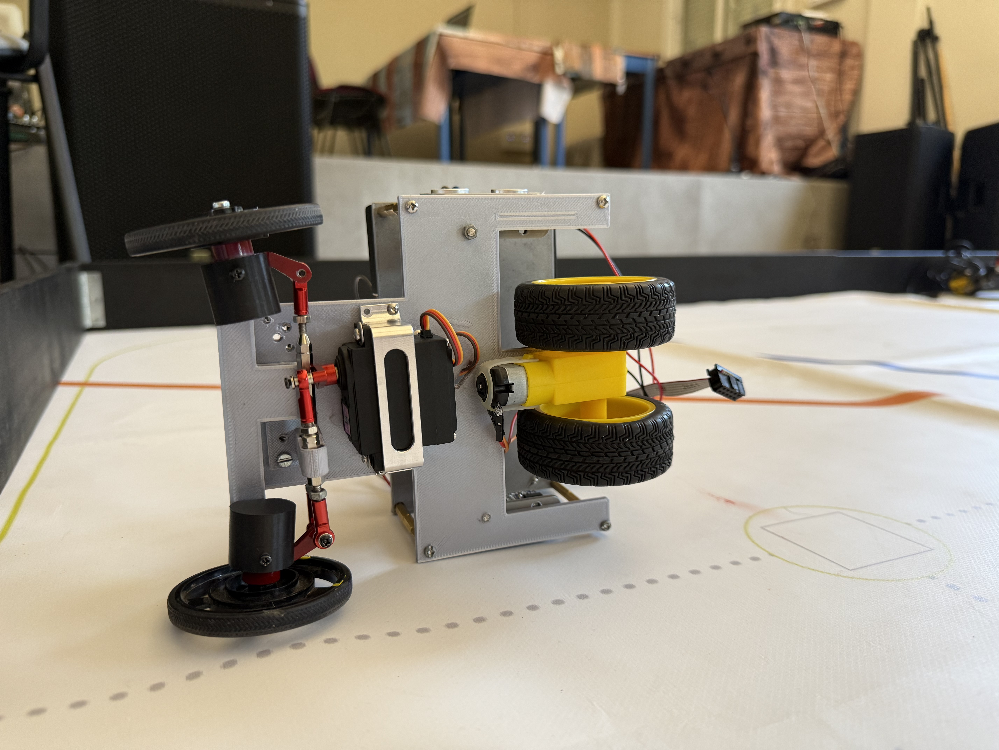
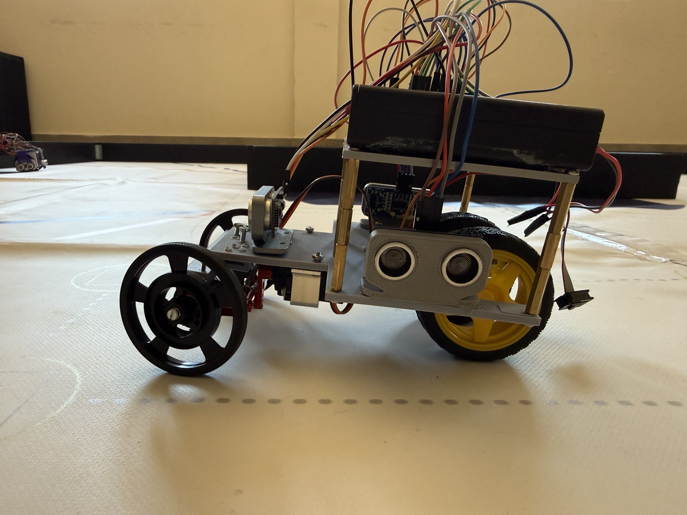
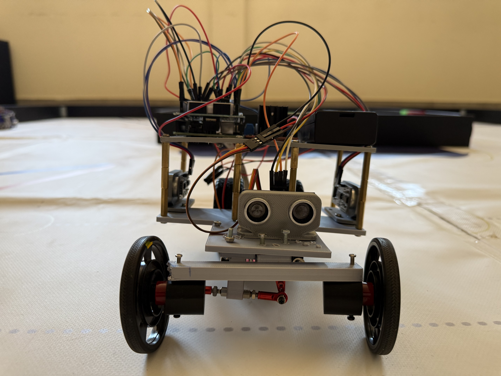
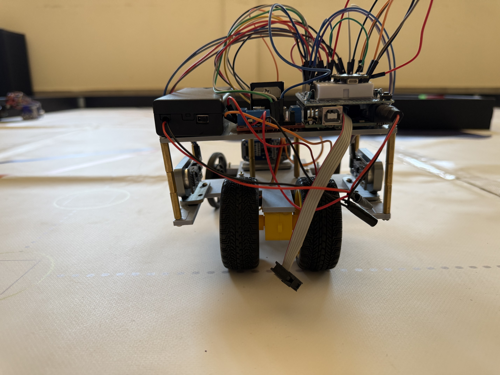

<table>
  <tr>
    <td>
      
      
Isometric View

    </td>
  </tr>
</table>

<table>
  <tr>
    <td>
      
      
Top View

    </td>
    <td>
      
      
Bottom View

    </td>
  </tr>
  <tr>
    <td>
      
      
Right View

    </td>
    <td>
      
      
Left View

    </td>
  </tr>
  <tr>
    <td>
      
      
Face View

    </td>
    <td>
      
      
Rear View

    </td>
  </tr>
</table>

